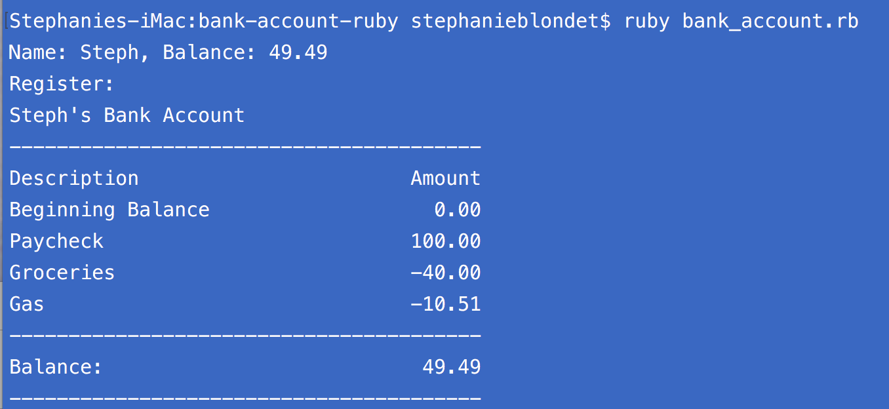

# Bank Account
Bank Account Class in Ruby using:
- Ruby Strings
- Ruby Numbers
- Ruby Methods
- Ruby Operators
- Ruby Arrays
- Ruby Hashes
- Ruby Collections
- Ruby Objects
- Ruby Classes
- Scope

------------------------
*This application was built while taking the 'Learn Ruby' track at Treehouse. January, 2017.
